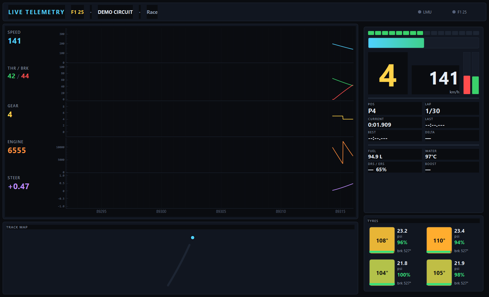

# Phantom Sim Telemetry

Десктопный **real-time дата-логгер** в стиле профессиональных телеметрий
(MoTeC i2 / McLaren ATLAS): прокручивающиеся каналы с курсором, приборы,
G-G метр, карта трассы, шины и **полный список каналов** — всё вживую, пока
пилот едет. Плюс раздача телеметрии **стратегу по сети (Radmin)**.

Поддерживаемые симуляторы:

* **iRacing** — читает shared memory (`Local\IRSDKMemMapFileName`, ~60 Гц).
* **Le Mans Ultimate** — shared memory плагина rFactor2 (`$rFactor2SMMP_*$`).
* **F1 25** — UDP-телеметрия (порт `20777`).



## Возможности

| Вкладка / зона | Содержимое |
|----------------|-----------|
| **ДАШБОРД → каналы** | 8 синхронных дорожек (Speed, Thr/Brk, Steer, G-Lat, G-Long, Gear, RPM, Δ-best) с **наводимым курсором** — значения всех каналов в любой точке |
| **ДАШБОРД → приборы** | шифт-лайты + RPM-бар, передача, скорость, педали, позиция, времена кругов, дельта, топливо, вода, DRS/ERS/буст |
| **ДАШБОРД → G-G метр** | боковое/продольное ускорение со следом и пиком |
| **ДАШБОРД → шины** | 4 угла: температура (цвет), давление, ресурс %, тормоза |
| **ДАШБОРД → карта трассы** | контур пишется из GPS на круге, точка = позиция |
| **ДАШБОРД → DATA** | плотная таблица вторичных каналов (давления, аиды, динамика, погода) |
| **ВСЕ КАНАЛЫ** | **полный список телеметрии iRacing** — каждая переменная (массивы по машинам раскрыты), значение + единицы, мгновенный поиск/фильтр |

## Раздача стратегу (Radmin)

Пилот включает раздачу — приложение отдаёт нормализованные кадры **и полный
дамп каналов** по TCP. Стратег на той же Radmin-сети открывает тот же интерфейс
и видит всё вживую (полный список троттлится до ~10 Гц, чтобы не грузить сеть).

* **Пилот:** карточка iRacing → «Локально» + «Раздавать стратегу» (порт `8100`).
* **Стратег:** карточка iRacing → снять «Локально» → ввести Radmin-IP пилота и порт `8100`.

Подробности — [`ИНСТРУКЦИЯ.md`](ИНСТРУКЦИЯ.md).

## Запуск

```bat
run.bat                 :: стартовый экран (выбор симулятора)
run-demo.bat            :: синтетические данные для предпросмотра
python main.py --demo
```

Зависимости: `pip install -r requirements.txt` (PyQt6, pyqtgraph, numpy;
для LMU-сети также `websocket-client`).

## Сборка .exe (для стратега, без Python)

```bat
python -m PyInstaller LiveTelemetry.spec --noconfirm
:: -> dist\LiveTelemetry.exe  (один файл)
```

## Структура

```
main.py                 точка входа (+ --demo)
sources/
  base.py               Frame — единый нормализованный кадр (+ raw: полный дамп)
  iracing_source.py     читатель shared memory iRacing (ctypes) + full-dump
  lmu_source.py         читатель shared memory rF2
  f1_source.py          UDP-парсер F1 25 -> Frame
  net_frame.py          раздача/приём кадров по TCP (FrameServer / NetFrameSource)
  demo_source.py        синтетический источник
ui/
  channel_graphs.py     стек графиков с курсором (pyqtgraph)
  channels.py           вкладка «ВСЕ КАНАЛЫ» (полный список, поиск)
  gauges.py / tyres.py / trackmap.py / gmeter.py / numeric.py
  mainwindow.py         сборка окна (вкладки) + цикл 30 Гц
  theme.py              тёмная палитра
```

## Лицензия / о MoTeC и ATLAS

Это **собственное** приложение жанра дата-логгера, а не копия закрытых MoTeC i2 /
McLaren ATLAS. Главное отличие — **реальное время прямо во время заезда** и
бесплатная раздача стратегу по сети, без лицензий и железа.

Часть экосистемы **Phantom**.
